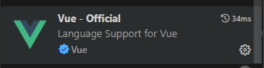
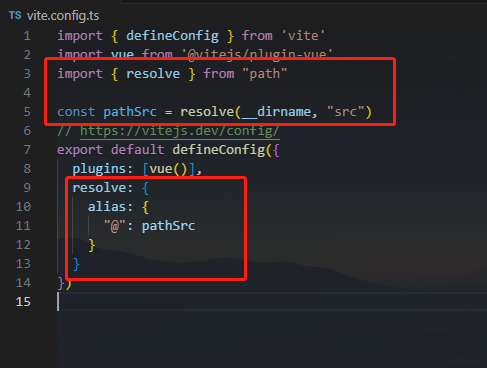
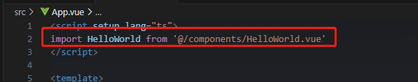
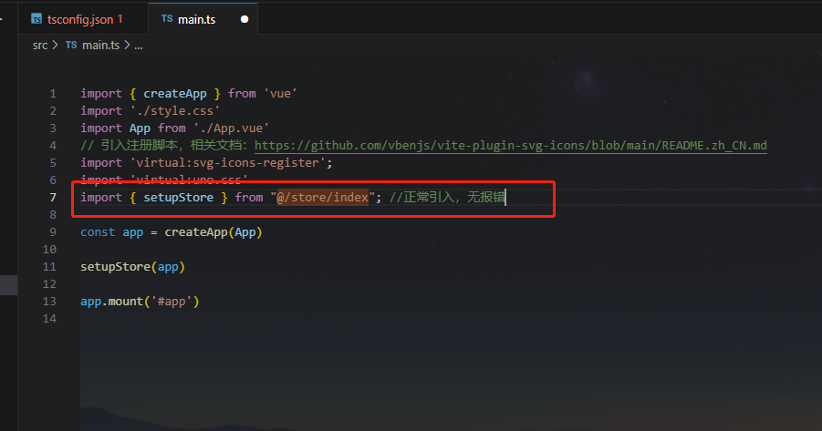
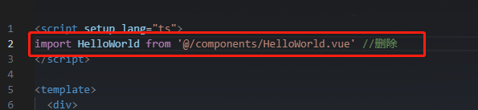
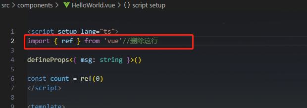
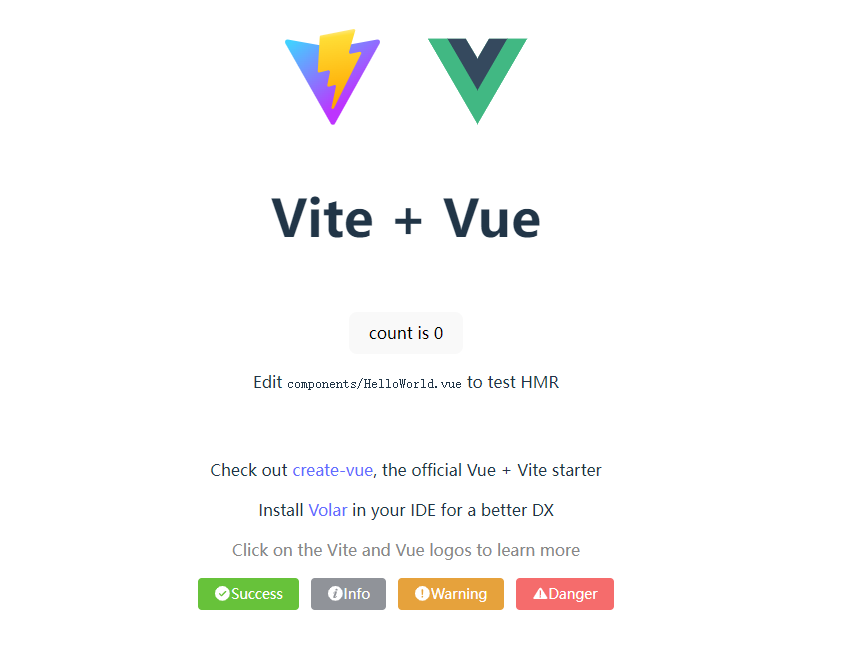
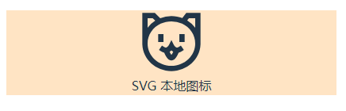
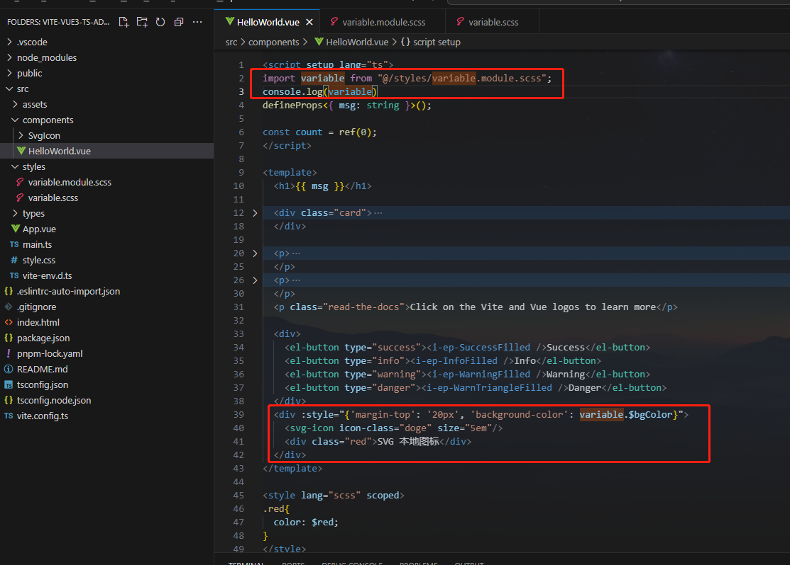
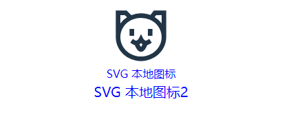

# Vite + Vue3 + Ts 开发后台管理系统

## 技术栈:

- Vite5.x
- Vue3.x
- Typescript5.x

## 项目初始化

- 首先，我们通过阅读 vite 官网（https://cn.vitejs.dev/guide/） 创建初始项目，
  我这里使用的是 pnpm 安装的方式。按照以下命令运行：

```typescript
pnpm create vite
project name: vite-vue3-ts-admin
Vue
Typescript
cd vite-vue3-ts-admin
pnpm install
pnpm run dev
```

- 如下图：然后我们可以看到启动成功，显示下图的页面。


## 环境配置

- 开发工具：vscode
- vscode 插件安装 Vue - Official，然后禁止 vetur



## 路径别名配置

- 配置 vite.config.ts ，代码如图所示：



- 运行以后，发现报错 path is not defined，本地安装 Node 的 TypeScript 类型描述文件即可解决编译器报错。

```typescript
pnpm i @types/node -D
```

- 现在，我们试用一下刚刚配置的别名功能是否生效

```typescript
// src/App.vue
import HelloWorld from '/src/components/HelloWorld.vue'
						↓
import HelloWorld from '@/components/HelloWorld.vue'
```



- 上面是配置vue文件里面的路径名解析，接下来我们配置一下TS文件的路径解析

<p>tsconfig.json中，我们加入下列配置，然后可以发现能正常解析路径映射了</p>

```typescript
{
  "compilerOptions": {
    "allowImportingTsExtensions": true,
    "paths": {
      //路径映射，相对于baseUrl
      "@/*": ["src/*"]
    }
  }
}
```



## unplugin 自动导入

- 现在主流项目中都是提倡按需导入，优点是可以减少无用资源引入，避免资源重复引入。缺点是每次按需引入时，需要手动引入。
  所以这里我们使用 unplugin 自动导入，解放双手。

<table>
  <thead>
    <tr>
      <th>插件</th>
      <th>概念</th>
      <th>自动导入对象</th>
    </tr>
  </thead>
  <tbody>
    <tr>
      <td>unplugin-auto-import</td>
      <td>按需自动导入API</td>
      <td>ref，reactive,watch,computed 等API</td>
    </tr>
    <tr>
      <td>unplugin-vue-components</td>
      <td>按需自动导入组件</td>
      <td>Element Plus 等三方库和指定目录下的自定义组件</td>
    </tr>
  </tbody>
</table>

开始安装：
```typescript
pnpm install -D unplugin-auto-import unplugin-vue-components

```

- 然后在vite.config.ts配置属性
```typescript
import { defineConfig } from "vite";
import vue from "@vitejs/plugin-vue";
import path from "path";
import AutoImport from "unplugin-auto-import/vite";
import Components from "unplugin-vue-components/vite";

const { resolve } = path
const pathSrc = resolve(__dirname, "src");
// https://vitejs.dev/config/
export default defineConfig({
  plugins: [
    vue(),
    AutoImport({
      // 自动导入 Vue 相关函数，如：ref, reactive, toRef 等
      imports: ["vue"],
      eslintrc: {
        enabled: true, // 是否自动生成 eslint 规则，建议生成之后设置 false 
        filepath: "./.eslintrc-auto-import.json", // 指定自动导入函数 eslint 规则的文件
      },
      dts: resolve(pathSrc, "types", "auto-imports.d.ts"), // 指定自动导入函数TS类型声明文件路径
    }),
    Components({
      dts: resolve(pathSrc, "types", "components.d.ts"), // 指定自动导入组件TS类型声明文件路径
    }),
  ],
  resolve: {
    alias: {
      "@": pathSrc,
    },
  },
});

```

- 如下图所示，我们删除引入ref和引入组件的代码。发现，项目并没有报错，至此，我们成功的实现了按需自动引入API、组件





- .eslintrc.cjs - 自动导入函数 eslint 规则引入（稍后在配置eslint的时候配置该选项）

```typescript
"extends": [
    "./.eslintrc-auto-import.json"
],
```

- tsconfig.json - 自动导入TS类型声明文件引入

```typescript
{
  "include": ["src/**/*.d.ts"]
}
```

## element plus 按需自动导入
在unplugin安装以后，我们可以开始按需自动导入element plus了

```typescript
pnpm i element-plus
```

- 安装自动导入 Icon 图标，该插件提供多个图标库（https://icon-sets.iconify.design/） 、自动下载图标库、自动导入图标、自动注册图标等功能。
element-plus 的图标库也被收集在依赖内。

```typescript
pnpm i -D unplugin-icons
```

- 到这一步时，我们的配置如下：

```typescript
import { defineConfig } from "vite";
import vue from "@vitejs/plugin-vue";
import path from "path";
import AutoImport from "unplugin-auto-import/vite";
import Components from "unplugin-vue-components/vite";
import { ElementPlusResolver } from "unplugin-vue-components/resolvers";
import Icons from "unplugin-icons/vite";
import IconsResolver from "unplugin-icons/resolver";


const { resolve } = path
const pathSrc = resolve(__dirname, "src");
// https://vitejs.dev/config/
export default defineConfig({
  plugins: [
    vue(),
    AutoImport({
      // 自动导入 Vue 相关函数，如：ref, reactive, toRef 等
      imports: ["vue"],
      eslintrc: {
        enabled: true, // 是否自动生成 eslint 规则，建议生成之后设置 false 
        filepath: "./.eslintrc-auto-import.json", // 指定自动导入函数 eslint 规则的文件
      },
      dts: resolve(pathSrc, "types", "auto-imports.d.ts"), // 指定自动导入函数TS类型声明文件路径
      resolvers: [
        // 自动导入 Element Plus 相关函数，如：ElMessage, ElMessageBox... (带样式)
        ElementPlusResolver(),
        // 自动导入图标组件
        IconsResolver({}),
      ],
      vueTemplate: true, // 是否在 vue 模板中自动导入
    }),
    Components({
      dts: resolve(pathSrc, "types", "components.d.ts"), // 指定自动导入组件TS类型声明文件路径
      resolvers: [
        // 自动导入 Element Plus 组件
        ElementPlusResolver(),
        // 自动注册图标组件
        IconsResolver({
          enabledCollections: ["ep"] // element-plus图标库，其他图标库 https://icon-sets.iconify.design/
        }),
      ],
    }),
    Icons({
      // 自动安装图标库
      autoInstall: true,
    })
  ],
  resolve: {
    alias: {
      "@": pathSrc,
    },
  },
});
```

- 添加element组件及icon

```html
<!-- src/components/HelloWorld.vue -->
<div>
  <el-button type="success"><i-ep-SuccessFilled />Success</el-button>
  <el-button type="info"><i-ep-InfoFilled />Info</el-button>
  <el-button type="warning"><i-ep-WarningFilled />Warning</el-button>
  <el-button type="danger"><i-ep-WarnTriangleFilled />Danger</el-button>
</div>
```

- 预览效果


## vite-plugin-svg-icons 生产SVG雪碧图

- 相关文档：[vite-plugin-svg-icons](https://github.com/vbenjs/vite-plugin-svg-icons/blob/main/README.zh_CN.md)

- 安装vite-plugin-svg-icons

```typescript
pnpm i -D vite-plugin-svg-icons
```

- 创建 src/assets/icons 目录 , 随便下载一个 svg 图标放入。

- 按照文档描述，在 main.ts 中引入注册脚本

```typescript
// src/main.ts
import 'virtual:svg-icons-register';
```

- vite.config.ts 配置插件

```typescript
import { createSvgIconsPlugin } from "vite-plugin-svg-icons";
const { resolve } = path;
export default defineConfig({
  plugins: [
    createSvgIconsPlugin({
      // 指定需要缓存的图标文件夹
      iconDirs: [resolve(process.cwd(), "src/assets/icons")],
      // 指定symbolId格式
      symbolId: "icon-[dir]-[name]", // dir是以iconDirs作为根目录，下面的子目录。name是文件名
    }),
  ]
});

```

- SvgIcon 组件封装

```vue
<!-- src/components/SvgIcon/index.vue -->
<script setup lang="ts">
const props = defineProps({
  prefix: {
    type: String,
    default: "icon",
  },
  iconClass: {
    type: String,
    required: false,
  },
  color: {
    type: String,
  },
  size: {
    type: String,
    default: "1em",
  },
});

const symbolId = computed(() => `#${props.prefix}-${props.iconClass}`);
</script>

<template>
  <svg
    aria-hidden="true"
    class="svg-icon"
    :style="'width:' + size + ';height:' + size"
  >
    <use :xlink:href="symbolId" :fill="color" />
  </svg>
</template>

<style scoped>
.svg-icon {
  display: inline-block;
  outline: none;
  width: 1em;
  height: 1em;
  vertical-align: -0.15em; /* 因icon大小被设置为和字体大小一致，而span等标签的下边缘会和字体的基线对齐，故需设置一个往下的偏移比例，来纠正视觉上的未对齐效果 */
  fill: currentColor; /* 定义元素的颜色，currentColor是一个变量，这个变量的值就表示当前元素的color值，如果当前元素未设置color值，则从父元素继承 */
  overflow: hidden;
}
</style>
```

- 组件使用

```vue
<!-- src/components/HelloWorld.vue -->
<template>
  <div style="margin-top: 20px; background-color: bisque;">
    <svg-icon icon-class="doge" size="5em"/>
    <div>SVG 本地图标</div>
  </div>
</template>
```



## scss安装

```typescript
pnpm i -D sass
```

- 创建 src/styles/variables.scss 变量文件，添加变量 $bgColor 定义，注意规范变量以 $ 开头

```typescript
// src/styles/variables.scss
$red: red;
```

- vite 配置导入 scss 全局变量文件

```typescript
css: {
  // CSS 预处理器
  preprocessorOptions: {
    //define global scss variable
    scss: {
      javascriptEnabled: true,
      additionalData: `@use "@/styles/variables.scss" as *;`
    }
  }
}
```

- style 标签使用 scss 全局变量

```typescript
<template>
  <div style="margin-top: 20px; background-color: bisque;">
    <svg-icon icon-class="doge" size="5em"/>
    <div class="red">SVG 本地图标</div>
  </div>
</template>

<style lang="scss" scoped>
.red{
  color: $red;
}
</style>
```

- 上面导入的 scss 全局变量在 typeScript 不生效的，可以通过在文件扩展名前加上 .module 来结合使用 CSS modules 和预处理器，例如 src/styles/variable.module.scss

```scss
// 导出 variable.scss 文件的变量
:export{
    $bgColor: $bgColor
}
```

- 然后在typeScript里面，引入该变量并且使用，如下图

```typescript
<script setup lang="ts">
import variable from "@/styles/variable.module.scss";
</script>

<template>
  <div :style="{'margin-top': '20px', 'background-color': variable.$bgColor}">
    <svg-icon icon-class="doge" size="5em"/>
    <div class="red">SVG 本地图标</div>
  </div>
</template>
```


## unocss安装

<p>即时按需原子 CSS 引擎</p>

- 安装UnoCSS

```typescript
pnpm i -D unocss
```

- vite.config.ts 配置

```typescript
// vite.config.ts
import UnoCSS from 'unocss/vite'
import { defineConfig } from 'vite'

export default defineConfig({
  plugins: [
    UnoCSS(),
  ],
})
```

- 根目录创建 uno.config.ts 文件

```typescript
//uno.config.ts
import { defineConfig } from 'unocss'
export default defineConfig({
  // ...UnoCSS options 具体配置可以查看unocss官网文档
  rules: [
    ['blue', { color: 'blue' }],
    ['ft20', { 'font-size': '20px' }],
  ],
  shortcuts: {
    'ft20-blue': 'blue ft20'
  }
})
```

- 入口文件main.ts中引入UnoCSS样式文件

```typescript
// main.ts
import 'virtual:uno.css'
```

- VSCode 安装 UnoCSS 插件，然后可以写一点测试代码，比如改变字体颜色，效果如下图所示：


```vue
// src/components/HelloWorld.vue
<template>
  <div class="blue">SVG 本地图标</div>
  <div class="ft20-blue">SVG 本地图标2</div>
</template>
```



## pinia安装

<p>Pinia 是 Vue 的专属状态管理库，它允许你跨组件或页面共享状态。可以理解成一个中心数据状态仓库。</p>
- 安装Pinia

```typescript
pnpm i pinia
```

- main.ts 引入 pinia

```typescript
// src/main.ts
import { createPinia } from "pinia";
import App from "./App.vue";

createApp(App).use(createPinia()).mount("#app");
```

- 定义store

<p>Store 定义分为选项式和组合式，在vue3项目中，一般推荐的是使用组合式的方式组织代码，所以这里我们选择组合式，保持项目代码风格统一。</p>

<p>新建文件 src/store/index.ts</p>

