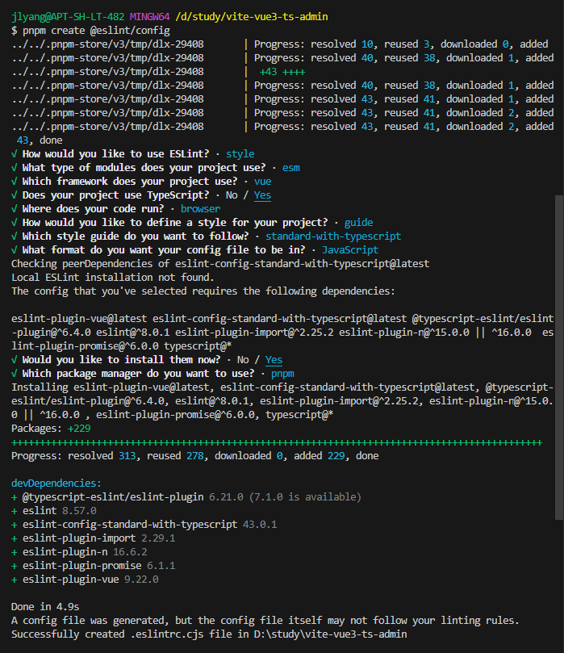

# Vite + Vue3 + Ts 开发后台管理系统

## 技术栈:

- Vite5.x
- Vue3.x
- Typescript5.x

## 使用 vite 创建项目

- 首先，我们通过阅读 vite 官网（https://cn.vitejs.dev/guide/） 创建初始项目，
  我这里使用的是 pnpm 安装的方式。按照以下命令运行：

```typescript
pnpm create vite
project name: vite-vue3-ts-admin
Vue
Typescript
cd vite-vue3-ts-admin
pnpm install
pnpm run dev
```


- 如下图：然后我们可以看到启动成功，显示下图的页面。


## 代码规范之保存代码时自动使用prettier和eslint对代码进行格式化

- VSCode 插件市场搜索 ESLint 插件并安装


- 安装并且配置eslint，这里用的版本是v8.57.0

```typescript
pnpm create @eslint/config
```

- 选择配置如下图：eslint安装模式选择（To check syntax, find problems, and enforce code style）。



- 根目录新建 .eslintignore 文件，添加忽略文件， ESLint 校验会忽略这些文件，配置如下图


- package.json 添加 eslint 检测指令

```typescript
  "scripts": {
    "lint:eslint": "eslint \"src/**/*.{vue,ts,js}\" --fix"
  }
```

- 执行命令进行 eslint 检测

```typescript
npm run lint:eslint
```

- eslint 保存自动检测

打开 File → Preferences → Settings 搜索 Editor: Code Actions On Save 选择 Workspace 标签设置工作区，点击 Edit in settings.json，添加如图代码


- VSCode 插件市场搜索 Prettier 插件并安装


- 安装依赖

```typescript
pnpm i -D prettier
```

- 根目录新建 .prettierrc.cjs 文件，用来添加相关配置，同时我们从官网 https://prettier.io/ 下载最新配置


- 根目录新建 .prettierignore 文件，添加忽略文件， prettier 格式化会忽略这些文件，配置如下图


- package.json 添加 prettier 格式化指令：

```typescript
  "scripts": {
    "lint:prettier": "prettier --write \"**/*.{js,ts,json,css,less,scss,vue,html,md}\""
  }
```

- 执行命令进行 prettier 代码格式化：

```typescript
pnpm run lint:prettier
```


- 保存代码自动进行 prettier 格式化，打开 File → Preferences → Settings 搜索 Editor: Code Actions On Save 选择 Workspace 标签设置工作区，点击 Edit in settings.json，添加如图代码


- 解决 eslint 和 prettier 的格式化冲突
  - eslint-config-prettier 的作用是关闭eslint中与prettier相互冲突的规则。
  - eslint-plugin-prettier 的作用是赋予eslint用prettier格式化代码的能力。 安装依赖并修改.eslintrc文件

开始安装:
```typescript
pnpm i -D eslint-config-prettier eslint-plugin-prettier
```

- 在.eslintrc.js文件中添加配置使得eslint可以使用prettier的格式化功能


- 同时，我们修改.vscode - setting.json中的配置，因为editor.defaultFormatter对vue不起作用，所以我们添加对vue文件的格式化配置，如下图：


- eslint只会对JS/TS起作用，prettier则对大部分的格式文件都起作用，在.vscode - setting.json中，其实是对文件进行了两次格式化，一次是使用
eslint对JS/TS进行代码质量检查并格式化，另外一次是使用prettier对大部分的文件进行格式化。这里的先后顺序猜测可能跟配置的属性先后，或者vscode内置
的调用有关，但无论如何，这两者是一个并集关系，都会使用到，又因为在.eslintrc.cjs中配置了忽略eslint和plugin冲突的规则，并使用prettier来进行格式化，
所以两者是一个融合的关系，并不冲突。最终，我们的本地代码规范就做好了，接下来，我们在GIT提交中对代码的格式化进行处理。

## 代码规范之husky，提交commit时，自动使用prettier和eslint对代码格式化并对commit-message进行规范化

- 安装husky之前，先进行初始化
```
git init
npx husky-init
```

- 然后安装官网推荐的配置执行下列命令
```
pnpm dlx husky-init && pnpm install
```